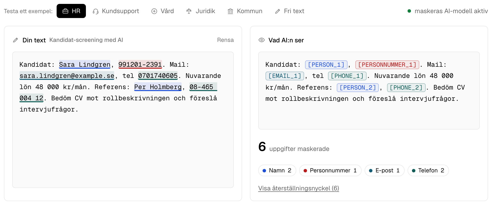
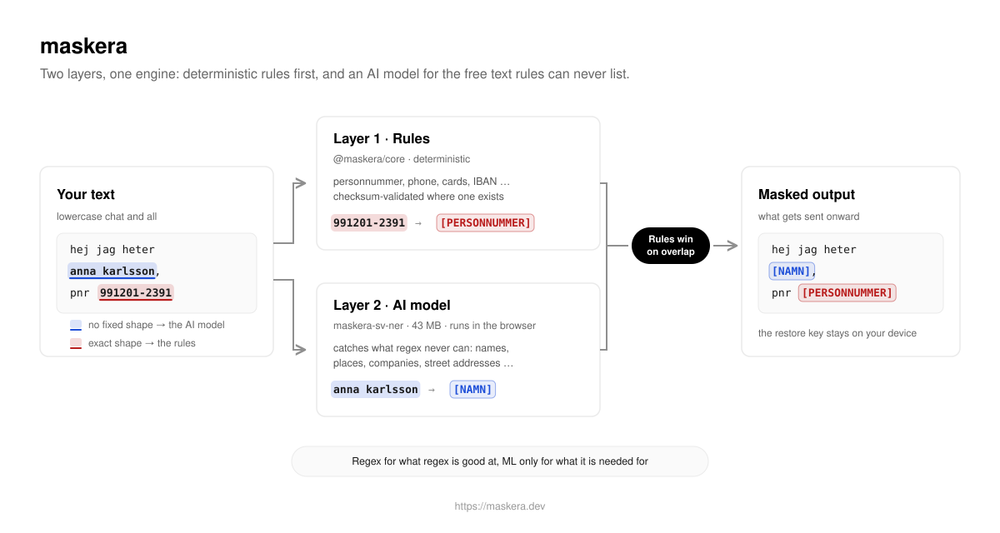

# maskera

> **Swedish PII redaction, on-device. Names, personnummer, addresses are masked before your text reaches an LLM, a log, or analytics.**

<a href="https://maskera.dev"></a>

```bash
npm install maskera @huggingface/transformers   # all-in-one: rules + my Swedish AI model
```

Yarn 4/PnP also needs the runtime leaf that Transformers.js 4.2 imports
without declaring: `yarn add maskera @huggingface/transformers@4.2.0
onnxruntime-common@1.24.3`. npm, pnpm and Bun use the shorter command above.

```ts
import { createNerRecognizer, redactWithNer } from "maskera"

const recognizer = createNerRecognizer() // my 43 MB Swedish model, runs in the browser
const { text, restore } = await redactWithNer(
  "hej jag heter anna karlsson, personnummer 19900101-2385, och bor i uppsala",
  { recognizer },
)
text
// "hej jag heter [NAMN_1], personnummer [PERSONNUMMER_1], och bor i [PLATS_1]"
```

Everything runs client-side. Nothing is sent anywhere, no telemetry, and the
restore map stays with you. `maskera` re-exports the whole rule layer,
so one import covers rules and model alike. Rules only, zero dependencies:
`npm install @maskera/core`. **[Live demo → maskera.dev](https://maskera.dev)**

## Choose how to run it

This public repository and the demo are the free, local-processing option:
your team owns the integration and operation. Companies that do not want to
operate it themselves can use
[Maskera Cloud](https://app.maskera.dev/pricing), where content is processed
in memory on EU-owned infrastructure with zero payload retention. Companies
that require original text and restore keys to remain in their own
environment can use the
[private Gateway](https://app.maskera.dev/gateway). Gateway is delivered as a
signed, digest-pinned OCI image with the same 43 MB model built in. It runs on
CPU without a database, GPU or separate model server, and masks every AI call
that the application routes through it before the approved upstream receives
the request.

The three options are compared at
[maskera.dev/tjanster](https://maskera.dev/tjanster). Full plan details,
contracts and Cloud/Gateway documentation live only on app.maskera.dev so
they cannot drift across repositories; the public site shows only the free
option and clear starting prices.

## The model is the point

[`maskera-sv-ner`](https://huggingface.co/joelhagvall/maskera-sv-ner) is our
own Swedish NER model: KB-BERT fine-tuned on synthetic + real Swedish,
distilled and shrunk to a **43 MB** ONNX that runs in the browser
(WebGPU/WASM) and in Node. It catches what regex never can: free-text names,
places, organisations and street addresses, including all-lowercase chat text
("hej jag heter anna karlsson"), ALL CAPS and genitive forms, because that is
how people actually type.

> **Benchmarks:** span F1 **99.8%** on the curated corpus (zero leaks), **94.7%** on
> independent real text, leak rate 0.0% / 3.4% (exact-span, q4, measured
> 2026-07-19). One canonical, dated, reproducible table:
> **[docs/BENCHMARKS.md](docs/BENCHMARKS.md)**; every other number in this
> repo defers to it.

Measured against the public Swedish NER alternatives in the dated comparison
table, it leads the best ~500 MB models on independent text (typed F1 0.96 vs
0.94) at a tenth of their size, and in the lowercase chat/support register it
targets, it masks 99.3% of rare out-of-training surnames and now types 78.2%
of them correctly as PERSON (previous release: 71.4%); on lowercased
encyclopedic prose the gap to the case-robust KBLab lowermix has nearly
closed (redaction recall 0.95 vs 0.97), documented honestly. Tables, model
scope, method and caveats: [docs/BENCHMARKS.md](docs/BENCHMARKS.md). The
training pipeline and the round-by-round journey are fully reproducible: see
[`training/`](training/). Every push to this repo re-grades the published
model in CI against a gold corpus with an F1 floor and a leak-rate ceiling.

## Two layers, rules first



1. **`@maskera/core`**: deterministic detectors for structured Swedish PII.
   Personnummer, samordningsnummer, organisationsnummer, phone, email,
   postnummer, bankgiro, plusgiro, IBAN, cards, IP, URL. Checksum-validated
   where a checksum exists, so `2019-2024` is not a bankgiro and
   `123456-0000` is not a person. Zero dependencies, synchronous, runs
   anywhere JavaScript runs. Anything you can regex (case ids, customer
   numbers) joins the same engine via `regexDetector`.
2. **`maskera`** (the package): everything above plus the Swedish model,
   with core fully re-exported. In the hybrid, rules win on overlap:
   structured PII is always handled deterministically, the model only fills
   the free-text gap. Its default rule set also enables the low-risk
   free-text heuristics (street `adress`, `lagenhetsnummer`), since whoever
   loads the model has free text by definition; only `regnummer` stays
   opt-in (plate shape = booking-code shape).

Rules alone when inputs are structured-ish; add the model when users type
free text. That split is the design: regex for what regex is good at, ML only
for what it is needed for.

## Use it before an LLM call

Redact on the way in, restore on the way out. The LLM never sees real data,
your code still gets real answers:

```ts
const { text: safePrompt, restore } = await redactWithNer(userInput, { recognizer })
const answer = await llm(safePrompt) // OpenAI / Anthropic / Vercel AI SDK, any
const result = restore(answer)       // placeholders back to real values, locally
```

Placeholders are **stable**: the same value always maps to the same token, so
the model can reason about `[NAMN_1]` consistently. The same one-liner works
before logging: `logger.info(redact(msg).text)`. Runnable example:
[`examples/llm-roundtrip.ts`](examples/llm-roundtrip.ts).

## Packages

| Package | Status | What it does |
| ------- | ------ | ------------ |
| [`@maskera/core`](packages/core) | ✅ ready | Zero-dep detectors + redact/restore engine |
| [`maskera`](packages/ner) | ✅ ready | My Swedish model via Transformers.js |
| `@maskera/node`, `@maskera/react` | ⏳ on demand | Wrappers, built when users ask |

Full API docs live in the package READMEs. For thresholds, self-hosting the
model, fallback patterns and an operational checklist, read
**[docs/PRODUCTION.md](docs/PRODUCTION.md)**.

## Live demo

Live at **[maskera.dev](https://maskera.dev)**: redaction as you type, with
curated Swedish scenarios (HR, kundsupport, vård, juridik, kommun) showing
exactly what the AI receives. The model loads in the background; rules work
instantly meanwhile. Run it locally:

```bash
pnpm install && pnpm demo   # http://localhost:5180
```

## Honesty & transparency

maskera is **defense in depth, not a compliance guarantee**. The rule layer
is deterministic; the model catches most free-text PII but no model is
perfect. The canonical numbers and their caveats live in
[`docs/BENCHMARKS.md`](docs/BENCHMARKS.md), and
[`docs/TRANSPARENCY.md`](docs/TRANSPARENCY.md) documents exactly what runs
where: 100% on-device, the only network calls are one-time fetches of the
model and the WASM runtime (never your text), self-hostable, trained without
collecting anyone's data
(synthetic sentences plus six public, openly licensed corpora of
already-published text).

For DPOs, security teams and legal reviewers there is a whitepaper covering
architecture, privacy model, training data, measured quality and GDPR
positioning: **[maskera.dev/whitepaper.pdf](https://maskera.dev/whitepaper.pdf)**
(LaTeX source in [`docs/whitepaper/`](docs/whitepaper/), rebuilt with
`node scripts/build-whitepaper.mjs`, requires `brew install tectonic`;
numbers always defer to [`docs/BENCHMARKS.md`](docs/BENCHMARKS.md)).

## Development

```bash
pnpm install
pnpm build && pnpm test
pnpm lint                  # biome
pnpm smoke                 # pack tarballs, install fresh, test ESM+CJS
pnpm eval                  # grade the published model against the gold corpus
```

CI runs all of the above on every push, plus a model eval gated on an F1
floor and leak-rate ceiling, and a weekly canary against the live Hub
artifact that opens an issue if anything drifts. Roadmap:
[`docs/ROADMAP.md`](docs/ROADMAP.md).

## License

Code: MIT © Joel Hägvall. Model weights: MIT (base model KB-BERT is CC0,
National Library of Sweden). See [`packages/ner/NOTICE`](packages/ner/NOTICE).
