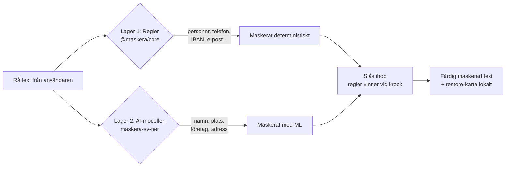
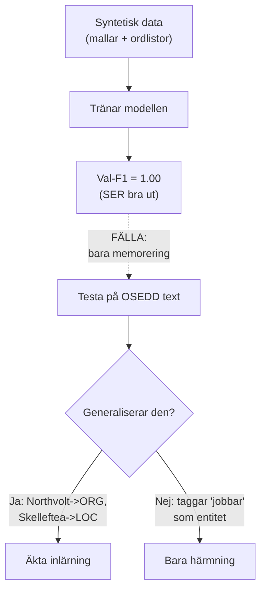
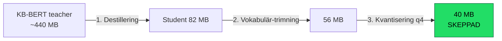
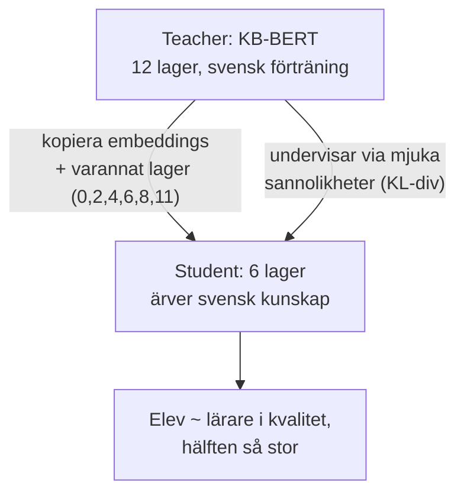
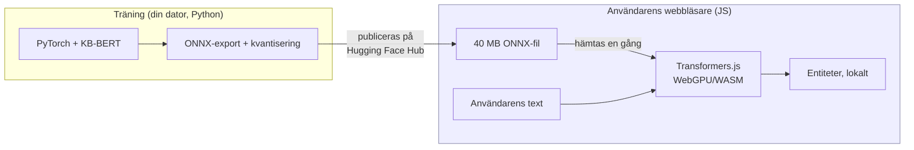
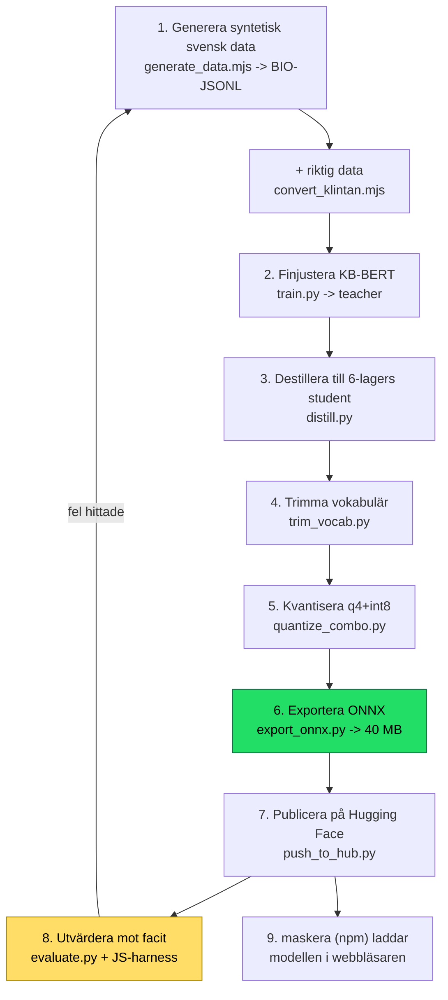

# Vad du har byggt: maskera, förklarat från grunden

> En genomgång av hela maskera-projektet, ML-strukturen och besluten bakom
> den, skriven så att du kan **försvara arbetet** för vem som helst: en
> rekryterare, en professor, en kund eller en skeptisk ingenjör. Vardagliga
> liknelser, diagram och referenser till var du kan läsa mer.

---

## 0. Den korta versionen (hissen)

> maskera tar bort personuppgifter ur svensk text **på användarens egen dator**,
> innan texten når en AI-tjänst, en logg eller analysverktyg. Den gör det i två
> lager: **regler** för sånt som har en exakt form (personnummer, telefon,
> IBAN) och en **egentränad svensk AI-modell** för fritext (namn, platser,
> företag, gatuadresser). AI-modellen är krympt från ~440 MB till **40 MB** så
> att den kan köra direkt i en webbläsare, utan att någon text lämnar datorn.

Om någon bara ger dig 20 sekunder är det där du ska landa. Resten av dokumentet
är för att du ska kunna svara på *varje* följdfråga.

---

## 1. Problemet: varför detta behövs

Tänk dig att du bygger en kundtjänst-chatt som skickar frågor vidare till
ChatGPT. En kund skriver:

> "hej jag heter anna karlsson, personnummer 19900101-2385, och bor i uppsala"

Skickar du det rakt in i ett externt AI-API så har du precis läckt en persons
namn, personnummer och ort till en tredje part. Det är ett GDPR-problem,
ett förtroendeproblem och i vissa branscher (vård, juridik, kommun) direkt
olagligt.

**Lösningen** är att *maskera* uppgifterna först:

```
hej jag heter [PERSON_1], personnummer [PERSONNUMMER_1], och bor i [LOCATION_1]
```

AI:n får en meningsfull mening, kan svara, och du byter tillbaka platshållarna
mot riktiga värden **lokalt** när svaret kommer. AI:n såg aldrig den riktiga
datan. Det här kallas ibland *redaction* eller *PII-scrubbing* (PII = Personally
Identifiable Information).

Referens att slå upp: [GDPR artikel 4](https://gdpr-info.eu/art-4-gdpr/)
(definitionen av personuppgift) och begreppet
[data minimisation](https://gdpr-info.eu/art-5-gdpr/).

---

## 2. Grundinsikten: två sorters personuppgifter

Din centrala designidé, och den du ska vara stolt över, är att personuppgifter
kommer i **två helt olika former**, och att de kräver olika verktyg.

| Typ | Exempel | Hur känner man igen den? |
| --- | --- | --- |
| **Strukturerad** | personnummer, telefon, IBAN, org-nr, e-post | Fast form. Ett personnummer är alltid 10-12 siffror med en kontrollsiffra. |
| **Fritext** | namn, platser, företag, gatuadresser | Ingen fast form. "Anna Karlsson" ser inte annorlunda ut än "glad karlek" rent teckenmässigt. Bara *sammanhanget* avslöjar att det är ett namn. |

### Liknelse

Strukturerad PII är som att hitta **svenska registreringsskyltar** i en bild:
de har ett exakt mönster (ABC123), och du kan skriva en regel som fångar dem
perfekt varje gång. Fritext-PII är som att hitta **alla hundar** i en bild:
det finns inget enkelt mönster, en chihuahua och en grävling ser olika ut,
och du behöver något som *lärt sig* hur en hund ser ut i praktiken.

Det är därför maskera har **två lager**:



**Varför inte bara AI för allt?** För att AI *gissar*, och för personnummer
vill du inte gissa, du vill ha 100 % rätt via en kontrollsiffra. **Varför inte
bara regler för allt?** För att du omöjligt kan skriva en regel som listar
alla svenska namn som finns eller kan uppstå. Rätt verktyg för rätt jobb. Det
här är hela poängen och en mogen ingenjörsinsikt: *regex för det regex är bra
på, ML bara för det som faktiskt kräver det.*

### Lager 1 i detalj: reglerna (`@maskera/core`)

Det här är vanlig kod, ingen AI. Detektorer för personnummer, samordnings-
nummer, organisationsnummer, telefon, e-post, postnummer, bankgiro, plusgiro,
IBAN, kortnummer, IP, URL. Det smarta: där det finns en **kontrollsiffra**
används den. Så `2019-2024` (ett årtal) förkastas som bankgiro, och
`123456-0000` förkastas som personnummer, eftersom kontrollsiffran inte
stämmer. Noll beroenden, synkront, kör var som helst JavaScript kör.

Kontrollsiffror bygger på den så kallade
[Luhn-algoritmen](https://sv.wikipedia.org/wiki/Luhn-algoritmen), samma
matematik som validerar kreditkortsnummer.

---

## 3. Vad AI-modellen faktiskt gör: NER

Modellens uppgift har ett namn i forskningen: **NER, Named Entity Recognition**
(igenkänning av namngivna entiteter). Det är en klassisk uppgift inom
språkteknologi (NLP).

### 3.1 Det är egentligen "sätt en etikett på varje ord"

Internt gör modellen *token-klassificering*: den går igenom texten ord för ord
och sätter en etikett på varje ord. Etiketterna använder ett schema som heter
**BIO** (även kallat IOB):

- **B-** = *Begin*, början på en entitet
- **I-** = *Inside*, fortsättningen på samma entitet
- **O** = *Outside*, inte en entitet alls

Exempel:

```
Patient    Anna     Karlsson  bor  i   Uppsala
O          B-PER    I-PER     O    O   B-LOC
```

"Anna" är början på en person (`B-PER`), "Karlsson" är fortsättningen på samma
person (`I-PER`), och "Uppsala" är en plats (`B-LOC`). Så vet systemet att
"Anna Karlsson" är *en* entitet på två ord, inte två separata.

Dina fyra fritext-typer är:

| Kod | Betyder | Exempel |
| --- | --- | --- |
| `PER` | Person | Anna Karlsson, Thorbjörn Fägerquist |
| `LOC` | Plats | Uppsala, Kungsholmen, Skellefteå |
| `ORG` | Organisation | Spotify, Northvolt, SEB |
| `ADR` | Gatuadress | Storgatan 14 |

Referens: [BIO-tagging på Wikipedia](https://en.wikipedia.org/wiki/Inside%E2%80%93outside%E2%80%93beginning_(tagging)).

### 3.2 Men modellen ser inte "ord", den ser "tokens"

En finess: modellen delar faktiskt upp texten i **subord** (subword tokens).
Ovanliga ord splittras i bitar. "Skellefteå" kan bli `Skel ##left ##eå`.
Det låter konstigt men är kraftfullt: det gör att modellen kan hantera ord
den aldrig sett förut genom att sätta ihop dem av kända bitar, precis som du
kan läsa ett påhittat ord som "obekymmersamhet" genom att känna igen delarna.

Din kod (`train.py`, funktionen `align`) hanterar detta genom att bara sätta
etikett på *första* biten av varje ord (`-100` betyder "ignorera denna bit vid
träning"). Efteråt syr `reconstruct()` i JS-lagret ihop bitarna till hela
spann igen. Det är ett vanligt men lätt att missa detalj, och du löste det.

Det här subord-systemet heter **WordPiece** och kommer från BERT. Referens:
[Subword tokenization, Hugging Face-kursen](https://huggingface.co/learn/nlp-course/chapter6/6).

---

## 4. Hjärnan: vad är en transformer / BERT?

Modellen bygger på **KB-BERT**, en svensk BERT-modell från Kungliga
biblioteket ([KBLab/bert-base-swedish-cased](https://huggingface.co/KBLab/bert-base-swedish-cased)).
För att försvara ditt val måste du kunna förklara vad det är.

### 4.1 Liknelsen

En **BERT-modell är som en person som läst nästan hela svenska internet men
aldrig fått ett specifikt jobb.** Den förstår svenska djupt: grammatik,
att "bor i ___" oftast följs av en plats, att stora bokstäver mitt i en mening
ofta är namn, att "AB" i slutet av något antyder ett företag. Den har den här
kunskapen från **förträning** (pre-training): den tränades av KB på enorma
mängder svensk text genom att man dolde ord och lät den gissa dem
("Han ___ i Stockholm" -> "bor"). Ingen märkte upp datan för hand, texten var
sin egen facit. Det kallas *self-supervised learning*.

Det du gjorde var att ge den här beläste personen ett **specifikt jobb**:
"markera personuppgifter". Det kallas **fine-tuning** (finjustering). Du behövde
inte lära den svenska från noll, bara lära den din uppgift. Det är därför du
klarade dig med tiotusentals exempel istället för miljarder.

### 4.2 Varför "transformer" är genombrottet

Det som gör BERT kraftfull heter **attention** (uppmärksamhet). Kort: när
modellen tittar på ordet "bank" så tittar den *samtidigt* på alla andra ord i
meningen för att avgöra betydelsen. "Jag satt vid bank­en och fiskade" vs "Jag
tog ut pengar på banken" ger olika tolkningar, och det är kringliggande ord som
avgör. Modellen väger hur mycket varje annat ord ska påverka tolkningen av det
aktuella. Det är den mekanismen som gör att den kan förstå att ett gemener-skrivet
"anna karlsson" mitt i en chatt ändå är ett namn, av *sammanhanget*.

Detta kommer från forskningsartikeln
["Attention is All You Need" (2017)](https://arxiv.org/abs/1706.03762),
en av de mest citerade AI-artiklarna som finns, och grunden för hela dagens
AI-våg (inklusive GPT). BERT-artikeln:
["BERT" (2018)](https://arxiv.org/abs/1810.04805).

### 4.3 Varför en svensk modell och inte en generell?

Du testade färdiga flerspråkiga PII-modeller på svenska och de underpresterade:
en missade "Lars Nordström" och märkte upp "Kungsholmen" som en gata. De är
tränade på engelsk-nära text och har svag svensk recall. Det är ett *starkt
försvarsargument*: du valde inte KB-BERT av bekvämlighet, du valde det för att
du **mätte** att alternativen var sämre på svenska. Att kunna säga "jag testade
och mätte" istället för "jag antog" är skillnaden mellan en hobbyist och en
ingenjör.

---

## 5. Träningsdatan: modellens "läromedel"

En modell är bara så bra som datan den tränas på. Det här är ofta 80 % av
arbetet i ett riktigt ML-projekt, och din data-berättelse är faktiskt den mest
imponerande delen av projektet.

### 5.1 Problemet: du får inte träna på riktiga personuppgifter

Du bygger ett *integritetsverktyg*. Att skrapa ihop riktiga svenskars namn och
personnummer för att träna på vore hyckleri och olagligt. Så du genererade
**syntetisk data**: `generate_data.mjs` bygger tiotusentals meningar av
mallar och ordlistor (gazetteers, listor med förnamn, orter, företag) och sätter
BIO-etiketterna automatiskt eftersom generatorn själv vet var namnen sitter.

Exempel på en genererad rad:

```json
{"tokens": ["Patient","Anna","Karlsson","bor","i","Uppsala"],
 "tags":   ["O","B-PER","I-PER","O","O","B-LOC"]}
```

Det här är GDPR-säkert: ingen riktig person, men samma *mönster* som riktig text.

### 5.2 Insikten som gör dig trovärdig: syntetisk data har ett tak

Här kommer det ärligaste och mest ingenjörsmässiga i hela projektet. Du
upptäckte att en modell tränad *bara* på dina mallar blir bra på att härma
mallarna men dålig på riktig, stökig text. Syntetisk data är ett **tak**, inte
en ersättning för verkligheten. Så du gjorde två saker:

1. **Felstyrda rundor (v1 -> v6).** Efter varje träning körde du modellen på ett
   riktigt facit och tittade på *vad den hade fel om*, sedan lade du till exakt
   den sortens exempel. Det här är klassisk *error-driven development*:

   | Runda | Vad felanalysen avslöjade | Vad du lade till | F1 (eget facit) |
   | --- | --- | --- | --- |
   | v1 | grunddata, ~30 mallar | – | 0.817 |
   | v2 | för lite variation | ~90 mallar, större ordlistor | 0.843 |
   | v3 | "Einride" taggades som person, siffror som adress | institutioner som ORG, sifferdistraktorer | 0.895 |
   | v4 | "EKG", "IBAN", "moms" taggades som företag | vanliga akronymer märkta som `O` | **0.946** |

   Notera hur varje runda löser ett *konkret, namngivet* fel. Det är precis så
   riktig ML-utveckling ser ut.

2. **Riktig data till slut (v6).** När syntetisk data tog slut som hävstång
   la du till riktigt märkt svensk text: **Swedish NER Corpus** (klintan /
   Webbnyheter 2012), ~6 900 riktiga meningar, konverterade med
   `convert_klintan.mjs`. Det bröt taket som ren syntetisk data satte.

### 5.3 En viktig ärlighetspoäng du ska kunna försvara

Din val-siffra på syntetisk data var **F1 = 1.00**. En nybörjare skulle skryta
om det. Du skriver rakt ut i dokumentationen att det är *meningslöst* som
kvalitetsbevis, eftersom valideringsdatan delar mallar med träningsdatan
(*in-distribution*). Den riktiga signalen är hur den klarar entiteter den
*aldrig sett*. Att förstå skillnaden mellan att memorera och att generalisera
är exakt det som skiljer någon som förstår ML från någon som kör recept.



---

## 6. Krympningen: från 440 MB till 40 MB

Det här är den tekniskt tyngsta delen och där mycket av ditt hantverk sitter.
Problemet: KB-BERT är ~440 MB. Ingen kommer ladda ner 440 MB i en webbläsare.
Målet är att modellen ska köra *på användarens dator* (för integritetens skull),
så den måste vara liten. Du använde tre tekniker i tur och ordning.



### 6.1 Destillering (knowledge distillation): lärare -> elev

**Liknelse:** en professor (teacher) kan sitt ämne men det tar 5 år att utbilda.
Du vill ha en duktig gymnasielärare (student) som kan 90 % av samma sak men får
plats i ett litet klassrum. Hur? Låt professorn *undervisa* eleven direkt.

Konkret (`distill.py`):

- **Teacher** = din finjusterade KB-BERT (12 lager).
- **Student** = en mindre BERT med bara **6 lager**.
- Eleven tränas inte bara på facit ("rätt svar är B-PER"), utan på lärarens
  *hela sannolikhetsfördelning* ("85 % B-PER, 10 % B-ORG, 5 % O"). De där
  mjuka gissningarna bär mer information, de lär eleven lärarens *osäkerhet*
  och nyanser. I koden är det `soft = KL-divergens mellan elevens och lärarens
  logits`, blandat med det hårda facit via `ALPHA = 0.5`.

Referens: [DistilBERT (2019)](https://arxiv.org/abs/1910.01108),
Hugging Faces egen destillering av BERT, exakt tekniken du använde.

#### Det avgörande tricket du fick rätt

Du testade att bygga en liten student **från noll** och den fick också
val-F1 1.00, men blev skräp på riktig text (taggade "jobbar" och "innan" som
entiteter). En liten modell utan svensk förträning *memorerar* bara. Fixen:
initiera elevens vikter **från lärarens** (kopiera inbäddningarna + varannat
lager). Då ärver eleven KB:s svenska förkunskap. Det är precis så DistilBERT
gör det. Att du hittade och dokumenterade den fällan är ett starkt tecken.



### 6.2 Vokabulär-trimning: släng ord du inte använder

KB-BERT kan ~50 000 olika ordbitar (vokabulären), och den tabellen är ungefär
*halva* modellens storlek. Men svensk PII-text använder bara en bråkdel av dem.
`trim_vocab.py` behåller de 16 000 mest använda bitarna (plus alla special- och
enteckensbitar så att vilket ord som helst fortfarande kan byggas). Resultat:
**82 -> 56 MB** för bara −0.04 i F1. En näst intill gratis vinst.

**Liknelse:** en ordbok med alla ord i alla ämnen är tjock. Behöver din app
bara prata om personuppgifter kan du riva ut kapitlen om medeltida heraldik och
marinbiologi utan att bli sämre på ditt jobb.

### 6.3 Kvantisering: färre decimaler per tal

En modell är miljontals tal (vikter). Normalt lagras varje tal som 32 bitar
(fp32, hög precision). **Kvantisering** lagrar dem grovare, som 8 bitar (int8)
eller 4 bitar (q4). Färre bitar per tal = mindre fil.

**Liknelse:** du behöver inte skriva `3,14159265358979` för att baka en paj,
`3,14` räcker. Att runda av alla modellens tal sparar enormt med plats och
kvaliteten sjunker bara marginellt.

Du dokumenterar ärligt vad som **inte** funkade: naiv q4 gjorde modellen
*större* (183 MB!) för att ONNX q4 bara kvantiserar matris-vikterna och lämnar
inbäddningstabellen i fp32. Fixen (`quantize_combo.py`): q4 på matriserna
*plus* int8 på den (nu lilla) inbäddningstabellen. Slutresultat: **40 MB** för
totalt ca −0.06 F1 jämfört med den odestillerade läraren. Det är en jättebra
avvägning.

Referens: [kvantisering, Hugging Face](https://huggingface.co/docs/optimum/concept_guides/quantization).

### 6.4 Storleksstegen (den ärliga tabellen)

| Artefakt | Storlek | Svensk kvalitet |
| --- | --- | --- |
| KB-BERT fp32 (teacher) | ~440 MB | bäst |
| teacher int8 ONNX | 125 MB | ✅ |
| destillerad student int8 | 82 MB | ✅ (≈ teacher) |
| + vokabulär-trimmad | 56 MB | ✅ (−0.04 F1) |
| **+ q4/int8-kombo** | **40 MB** | ✅ (−0.06 F1), **skeppad** |

---

## 7. Att köra i webbläsaren: ONNX och Transformers.js

Modellen tränas i Python (PyTorch), men webbläsare kör inte Python. Du
exporterar därför till **ONNX** (`export_onnx.py`), ett standardformat för
modeller som fungerar överallt. Det är som att exportera ett dokument till PDF:
oberoende av vilket program som skapade det.

I webbläsaren körs ONNX-modellen av **Transformers.js** (Hugging Faces
JS-bibliotek), som använder **WebGPU** (grafikkortet) om det finns, annars
**WASM** (WebAssembly, snabb kod i webbläsaren). Poängen: **all inferens sker
lokalt**. Det enda som hämtas över nätet är själva modellfilen och körtiden,
en gång. Din text lämnar aldrig datorn.



Referenser: [ONNX](https://onnx.ai/),
[Transformers.js](https://huggingface.co/docs/transformers.js),
[WebAssembly](https://webassembly.org/).

---

## 8. Hela pipelinen på ett ställe

Så här hänger allt ihop, från idé till den fil som kör i din demo:



Den streckade pilen från "utvärdera" tillbaka till "generera data" är
**hjärtat** i projektet: det är den felstyrda loopen. Du gick inte rakt igenom
en gång, du varvade v1 -> v7 där varje varv rättade konkreta fel.

---

## 9. Hur vet man att den är bra? Utvärdering

En modell utan mätning är en åsikt. Din utvärdering är rigorös och ärlig, det är
det som gör siffrorna trovärdiga. Du har **tre** olika facit, medvetet, och det
är viktigt att hålla isär vad var och en faktiskt bevisar:

| Facit | Vad det är | Hur du läser det |
| --- | --- | --- |
| **Curated corpus** | 148 handskrivna meningar, samma författare som datagenereratorn | *Övre gräns* och regressionsvakt, inte universellt betyg |
| **Independent gold** | 22 meningar riktig Wikipedia-prosa, skriven av andra, från en helt annan distribution än träningen | *Ärligt golv* och den enda **rent oberoende** mätningen: hur den klarar text den inte "känner" |
| **Swedish NER Corpus (test-split)** | 2 453 publika nyhetsmeningar, märkta av andra | *Stort held-out-tal*, men **in-distribution**: modellen tränade på samma korpus **train-split** |

### En avgörande distinktion du måste kunna: held-out vs oberoende

Det här är den enda punkten där det är lätt att luras, av sig själv eller andra.
Swedish NER Corpus-siffran (2 453 meningar) är *stor och stabil*, men den är
**inte rent oberoende**, för modellen tränade på train-splitten av *samma*
korpus (v6, se avsnitt 5.2). Test- och train-splitten delar källa, domän,
register och annoteringsregler. Så det är ett **held-out-tal från
träningsdistributionen**: meningarna är osedda (ingen memorering), men domänen
är inte ny. Det bevisar att modellen generaliserar *inom* sin distribution,
inte *utanför* den.

Det *rent* oberoende facit är fortfarande bara de 22 Wikipedia-meningarna: annan
källa, annan distribution, aldrig tränat på. Litet, men ärligt. Att säga
"86 % på oberoende data" vore alltså en överdrift, det rätta är "86 % på ett
stort held-out-test av träningsdistributionen, 91,5 % på ett litet rent
oberoende set". Att kunna göra den skillnaden är exakt vad en skarp granskare
testar dig på.

### De uppmätta talen

- Curated: span-F1 **96.4 %**, läckage **1.0 %** (per 2026-07-04)
- Rent oberoende (Wikipedia, 22 meningar): span-F1 **91.5 %**, läckage **1.7 %**
- Held-out in-distribution (klintan test, 2 453 meningar): span-F1 **85.9 %**,
  läckage **8.4 %** (per 2026-07-05). Recall per typ: PERSON 91.8 %,
  LOCATION 91.0 %, **ORGANIZATION 74.4 %**.

Mönstret är ärligt och förväntat: siffran sjunker när facit blir större och
stökigare, och ORG är den svagaste typen i varje mätning, precis som din egen
tränings-README förutspår. Ingen drift, ingen skönmålning.

### Måtten du ska kunna förklara

- **Precision** = av allt modellen flaggade, hur mycket var *rätt*? (Hög
  precision = få falsklarm.)
- **Recall** = av alla riktiga personuppgifter, hur många *hittade* den? (Hög
  recall = få missar.)
- **F1** = det harmoniska medelvärdet av de två, ett enda tal som balanserar dem.
- **Leak rate (läckage)** = andelen personuppgifter som *helt missades*. **Det
  här är säkerhetsmåttet.** För ett integritetsverktyg är en miss farligare än
  ett falsklarm, för en miss betyder att riktig PII läckte vidare.

**Liknelse (fisknät):** precision = "av allt jag fångade, hur mycket var
faktiskt fisk och inte skräp?". Recall = "av all fisk i sjön, hur mycket
fångade jag?". För maskera vill du hellre få med lite tång (lägre precision) än
missa en fisk (läckage), eftersom en missad personuppgift är den dyra sortens
fel. Du valde medvetet att luta åt hög recall / lågt läckage. Det är rätt
avvägning för ändamålet, och du kan motivera den.

De uppmätta talen står i avsnittet ovan. Den enda kanoniska, daterade tabellen
är [`docs/BENCHMARKS.md`](BENCHMARKS.md), och varje CI-körning betygsätter om den
publicerade modellen mot ett facit med ett F1-golv och ett läckage-tak. Att ha
regressionstester på en *ML-modell* i CI är ovanligt moget.

### Nyckelbegrepp för att låta trovärdig

- **Generalisering vs memorering** (avsnitt 5.3): den viktigaste skillnaden.
- **In-distribution vs out-of-distribution**: att testa på data som liknar
  träningen ("in-distribution") ljuger om kvaliteten. Det ärliga är att testa
  på data som *inte* liknar den ("out-of-distribution"), ditt oberoende facit.
- **Precision/recall-avvägning**: du kan nästan alltid köpa den ena med den
  andra. Vilken du prioriterar är ett *produktbeslut*, inte ett tekniskt.

---

## 10. Vanliga försvarsfrågor och dina svar

**"Varför inte bara använda ChatGPT för att maskera texten?"**
Då skickar du den känsliga texten till just den tjänst du försöker skydda den
från. Hela poängen är att maskering måste ske *innan* och *lokalt*. Dessutom är
en 40 MB specialmodell snabbare, gratis och deterministisk jämfört med ett API.

**"Varför inte bara regex för allt?"**
Regex kan inte veta att "anna karlsson" är ett namn men "glad karlek" inte är
det, det kräver förståelse av sammanhang. Namn, platser och företag har ingen
fast form. Det är precis gränsen mellan lager 1 och lager 2.

**"96 % låter inte perfekt?"**
Nej, och maskera säljer sig ärligt som *defense in depth, inte en garanti*.
Inget modell är perfekt. Därför finns det deterministiska regellagret för det
som *måste* vara rätt (personnummer), och därför mäts och publiceras läckaget
öppet istället för att gömmas.

**"Är syntetisk data inte fusk?"**
Tvärtom, det är det etiska valet för ett integritetsverktyg: du kan inte träna
på riktiga personuppgifter. Och du bevisar att modellen generaliserar till
riktiga, osedda namn, så den härmar inte bara mallarna. Till slut blandade du
dessutom in riktig märkt nyhetstext.

**"Hur vet du att kvantiseringen inte förstörde den?"**
Den mäts. Storleksstegen i avsnitt 6.4 visar F1-kostnaden för varje steg
(−0.04, −0.06...), och CI betygsätter den *kvantiserade, publicerade* filen,
inte den stora Python-modellen. Du testar det du faktiskt skeppar.

**"Vad är det egentligen för modell under huven?"**
En BERT-transformer (KB-BERT från Kungliga biblioteket), finjusterad för
token-klassificering med BIO-schema, destillerad från 12 till 6 lager,
vokabulär-trimmad och kvantiserad till q4/int8, exporterad till ONNX och körd
lokalt via Transformers.js.

---

## 11. Ordlista (snabbrepetition)

| Term | Enkel förklaring |
| --- | --- |
| **PII** | Personuppgift (Personally Identifiable Information) |
| **NER** | Named Entity Recognition: hitta namn/plats/org i text |
| **Token** | En bit text modellen ser (ord eller delord) |
| **BIO-tagging** | Etikettschema: Begin / Inside / Outside en entitet |
| **BERT** | En transformer-modell som förstår språk från förträning |
| **Fine-tuning** | Ge en förtränad modell en specifik uppgift |
| **Attention** | Mekanismen där varje ord vägs mot alla andra |
| **Distillation** | Krympa en stor modell genom att låta den lära en liten |
| **Teacher/Student** | Den stora respektive lilla modellen i destillering |
| **Quantization** | Lagra vikterna med färre bitar för mindre storlek |
| **Vocab trimming** | Slänga oanvända ordbitar ur vokabulären |
| **ONNX** | Portabelt modellformat, "PDF för modeller" |
| **Transformers.js** | Kör modeller i webbläsaren (WebGPU/WASM) |
| **Precision** | Av det jag flaggade, hur mycket var rätt |
| **Recall** | Av allt som fanns, hur mycket hittade jag |
| **F1** | Balanserat medel av precision och recall |
| **Leak rate** | Andel PII som helt missades (säkerhetsmåttet) |
| **Generalisering** | Att fungera på osedd data, inte bara memorera |

---

## 12. Om du bara minns tre saker

1. **Två lager, rätt verktyg för rätt jobb.** Regler (deterministiska) för
   strukturerad PII, en egentränad AI-modell för fritext. Att veta *var*
   gränsen går är hela insikten.

2. **Data-berättelsen är hantverket.** Syntetisk data (etiskt, GDPR-säkert)
   + felstyrda rundor v1 -> v7 + riktig data till slut. Du memorerade inte,
   du generaliserade, och du bevisade det med oberoende facit.

3. **Krympt utan att tappa kvaliteten, och mätt hela vägen.** 440 -> 40 MB via
   destillering + vokabulär-trimning + kvantisering, så den kör lokalt i
   webbläsaren. Varje steg har en dokumenterad F1-kostnad, och CI betygsätter
   den fil du faktiskt skeppar.

Det, i ett nötskal, är ett litet men fullständigt och ärligt ML-projekt:
från problem, till data, till arkitektur, till komprimering, till mätning,
till produktion. Att kunna berätta den kedjan är att försvara ditt arbete.
